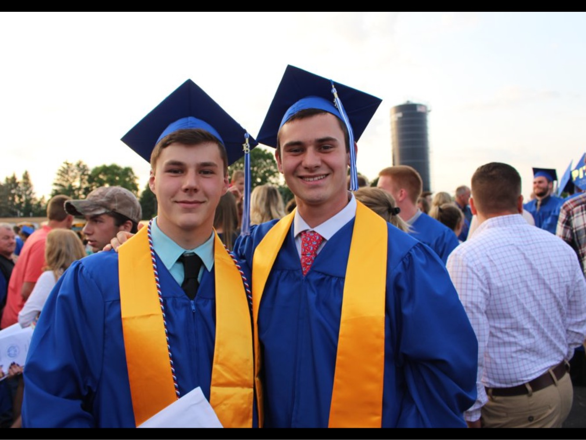
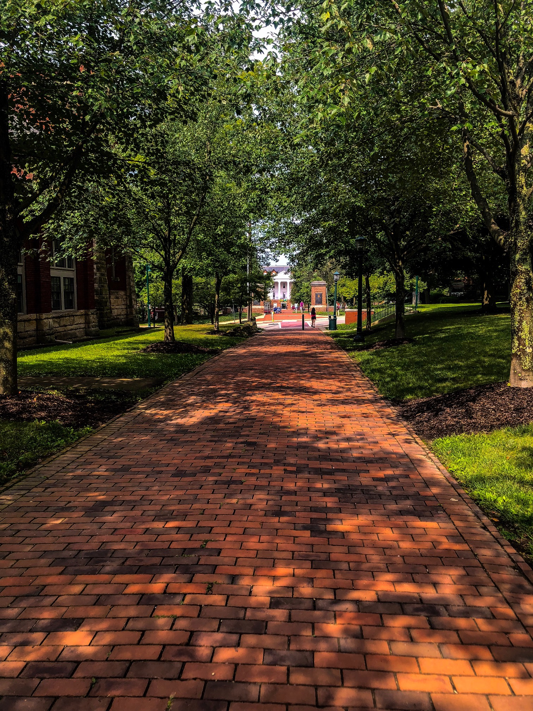
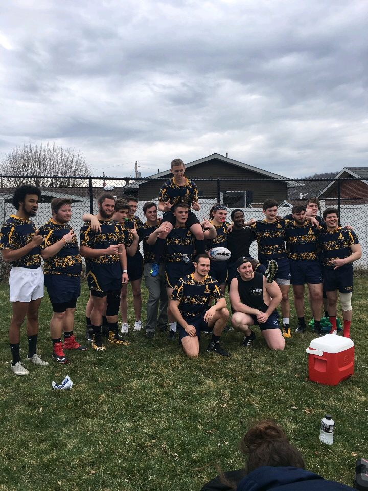
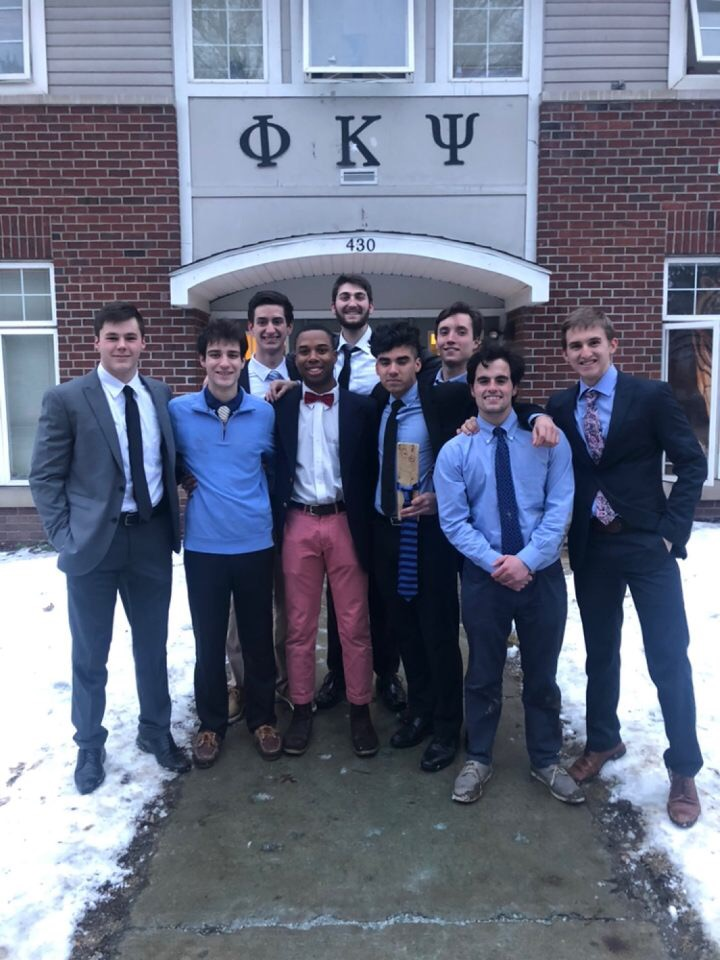

_College has been one of the greatest, and hardest times of my life. As
you will see through the pictures below I have made some amazing memories._

<!-- end -->

## Getting Started

At first I had struggled quite a bit with being away from home. The picture below
is of me and my cousin Bradley, and it just reminds me of all the friends I had
to leave back. Nonetheless I decided to give college my best shot and be open to
new things!

## Being Comfortable On Campus

Actually arriving on campus was a whole new world for me : I didn't know a single person. For such a small campus it seemed so big at the time. I had to carry a map around for the first couple weeks just so I wouldn't get lost! With time everything got easier and I was able to finally find my way.

## Getting Involved

Trying to find yourself in college is one of the hardest things to do! I personally had no idea what I had wanted to do with my major, let alone campus activities. Trying new things opens you up to different perspectives and makes you overall more well-rounded. This was [Allegheny Rugby](https://sites.allegheny.edu/studentinvolvement/rugby-mens/) for me here on campus. It allowed me to stay in shape and make some friends!

## Lifelong Friends

College can also be a place where you meet friends that you will have forever! I decided to try something new with participating in Greek life and I could not have made a better decision. These guys are some of my closest friends and people I know I can rely on the most!

